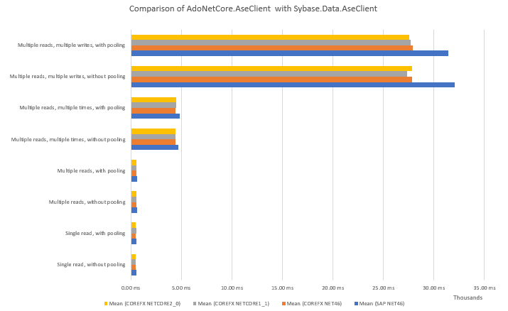

# AdoNetCore.AseClient - a .NET Core DB Provider for SAP ASE

SAP (formerly Sybase) has supported accessing the ASE database management system from ADO.NET for many years. Unfortunately SAP has not yet made a driver available to support .NET Core, so this project enables product teams that are dependent upon ASE to keep moving their application stack forwards.

The current .NET 4 version of SAP's AseClient driver is a .NET Framework managed wrapper around SAP's unmanged [ADO DB provider](https://en.wikipedia.org/wiki/ActiveX_Data_Objects) and is dependent upon [COM](https://en.wikipedia.org/wiki/Component_Object_Model). COM is a Windows-only technology and will never be available to .NET Core, making it difficult to port the existing SAP driver.

Under the hood, ASE (and Microsoft Sql Server for that matter) relies on an application-layer protocol called [Tabular Data Stream](https://en.wikipedia.org/wiki/Tabular_Data_Stream) to transfer data between the database server and the client application. ASE uses TDS 5.0.

This project provides a .NET Core native implementation of the TDS 5.0 protocol via an ADO.NET DB Provider, making SAP ASE accessible from .NET Core applications hosted on Windows, Linux, Docker and also serverless platforms like [AWS Lambda](https://aws.amazon.com/lambda/).

## Objectives
* Functional parity with the `Sybase.AdoNet4.AseClient` provided by SAP. Ideally, our driver will be a drop in replacement for the SAP AseClient (with some namespace changes). The following types are supported:
    * AseCommand - in progress
    * AseCommandBuilder
    * AseConnection - in progress
    * AseDataAdapter
    * AseConnectionPool
    * AseConnectionPoolManager
    * AseParameter
    * AseParameterCollection
    * AseDataReader - in progress
    * AseDbType
    * AseError
    * AseErrorCollection
    * AseException - in progress
    * AseInfoMessageEventArgs
    * AseInfoMessageEventHandler 
    * AseRowUpdatedEventArgs - .NET Core 2.0+
    * AseRowUpdatedEventHandler - .NET Core 2.0+
    * AseRowUpdatingEventArgs - .NET Core 2.0+
    * AseRowUpdatingEventHandler - .NET Core 2.0+
    * TraceEnterEventHandler
    * TraceExitEventHandler
* The following features are not *yet* supported:
    * `Bulk Copy` - no reason this can't be supported, just hasn't been a priority thus far. As such the following types have not yet been implemented:
        * [AseBulkCopy](http://infocenter.sybase.com/help/topic/com.sybase.infocenter.dc20066.1570100/doc/html/san1364409524288.html)
        * [AseBulkCopyColumnMapping](http://infocenter.sybase.com/help/topic/com.sybase.infocenter.dc20066.1570100/doc/html/san1364409528570.html)
        * [AseBulkCopyColumnMappingCollection](http://infocenter.sybase.com/help/topic/com.sybase.infocenter.dc20066.1570100/doc/html/san1364409530992.html)
        * [AseBulkCopyOptions](http://infocenter.sybase.com/help/topic/com.sybase.infocenter.dc20066.1570100/doc/html/san1364409533851.html)
        * [AseRowsCopiedEventArgs](http://infocenter.sybase.com/help/topic/com.sybase.infocenter.dc20066.1570100/doc/html/san1364409610666.html)
        * [AseRowsCopiedEventHandler](http://infocenter.sybase.com/help/topic/com.sybase.infocenter.dc20066.1570100/doc/html/san1364409612103.html)
    * `Failover` - no reason this can't be supported, just hasn't been a priority thus far. As such the following types have not yet been implemented:
        * [AseFailoverException](http://infocenter.sybase.com/help/topic/com.sybase.infocenter.dc20066.1570100/doc/html/san1364409597900.html)
    * `AseDecimal` - no reason this can't be supported, but it's complicated. See also [#10](https://github.com/DataAction/AdoNetCore.AseClient/issues/10).
* The following features are not supported:
    * `Code Access Security` - CAS is [no longer recommended by Microsoft](https://docs.microsoft.com/en-us/dotnet/framework/misc/code-access-security) and [will not be supported in .NET Core](https://github.com/dotnet/corefx/blob/master/Documentation/project-docs/porting.md#code-access-security-cas). For binary compatibility the following stubs have been added in .NET Core 2.0+ but they do nothing:
        * AseClientPermission
        * AseClientPermissionAttribute
    * `ASE Functions` - The SAP AseClient provides an `AseFunctions` type filled with utility functions that aren't implemented. This type will not be supported as it doesn't do anything. Consumers should remove references to this type.
* The following types are not yet supported:
    * [AseClientFactory](http://infocenter.sybase.com/help/topic/com.sybase.infocenter.dc20066.1570100/doc/html/san1364409534226.html) - waiting on .NET Core 2.1 for this type to be supported.

* Performance equivalent to or better than that of `Sybase.AdoNet4.AseClient` provided by SAP. This should be possible as we are eliminating the COM and OLE DB layers from this driver and .NET Core is fast.
* Target all versions of .NET Core (1.0, 1.1, 2.0, and 2.1 when it is released)
* Should work with [Dapper](https://github.com/StackExchange/Dapper) at least as well as the .NET 4 client

## Performance benchmarks

### Test methodology
To help adopt the AdoNetCore.AseClient, we have benchmarked it against the Sybase.Data.AseClient. See the wiki for how to [run the benchmarks yourself](https://github.com/DataAction/AdoNetCore.AseClient/wiki/Running-the-benchmarks).

We have benchmarked the .NET Core AseClient against the SAP AseClient in the following ways:

#### Single read, without pooling
Open a connection (unpooled) and invoke AseCommand.ExecuteReader(...) once and read back one row of data.

#### Single read, with pooling
Open a connection (pooled) and invoke AseCommand.ExecuteReader(...) once and read back one row of data.

#### Multiple reads, without pooling
Open a connection (unpooled) and invoke AseCommand.ExecuteReader(...) once and read back 12 rows of data.

#### Multiple reads, with pooling
Open a connection (pooled) and invoke AseCommand.ExecuteReader(...) once and read back 12 rows of data.

#### Multiple reads, multiple times, without pooling
Open a connection (unpooled) and invoke AseCommand.ExecuteReader(...) 9 times, and read back 11-12 rows of data each time.

#### Multiple reads, multiple times, with pooling
Open a connection (pooled) and invoke AseCommand.ExecuteReader(...) 9 times, and read back 11-12 rows of data each time.

#### Multiple reads, multiple writes, without pooling
Open a connection (unpooled) and invoke AseCommand.ExecuteReader(...) once, reading back 56 rows of data. Prepare a new AseCommand and invoke AseCommand.ExecuteNonQuery(...) for each of the 56 rows to update the database.

#### Multiple reads, multiple writes, with pooling
Open a connection (pooled) and invoke AseCommand.ExecuteReader(...) once, reading back 56 rows of data. Prepare a new AseCommand and invoke AseCommand.ExecuteNonQuery(...) for each of the 56 rows to update the database.

We perform these tests for .NET Core 1.1, .NET Core 2.0, and .NET Standard 4.6 using the AdoNetCore.AseClient. For comparison, we also perform these tests on .NET Standard 4.6 using the Sybase.Data.AseClient from SAP.

The goal of the benchmarking is not to establish the absolute performance of the driver or the ASE Server, but to show its equivalence as a substitute. As such, the test client and database server have been held constant in all tests.

###Server:
Adaptive Server Enterprise/16.0 SP03 PL02/EBF 27413 SMP/P/AMD64/Windows 2008 R2 SP1/ase160sp03pl02x/0/64-bit/FBO/Fri Oct 06 14:34:03 2017

###Client:
BenchmarkDotNet=v0.10.11, OS=Windows 10 Redstone 2 [1703, Creators Update] (10.0.15063.726)
Processor=Intel Core i7-6700 CPU 3.40GHz (Skylake), ProcessorCount=8
Frequency=3328123 Hz, Resolution=300.4697 ns, Timer=TSC
.NET Core SDK=2.1.3
  [Host]     : .NET Core 2.0.4 (Framework 4.6.25921.01), 64bit RyuJIT
  DefaultJob : .NET Core 2.0.4 (Framework 4.6.25921.01), 64bit RyuJIT

### Test results


## Connection strings
[connectionstrings.com](https://www.connectionstrings.com/sybase-adaptive/) lists the following connection string properties for the ASE ADO.NET Data Provider. In keeping with our objective of being a drop-in replacement for the SAP AseClient, we aim to use identical connection string syntax to the SAP AseClient, however our support for the various properties will be limited. Our support is as follows:

| Property                                                                                   | Support   | Notes
| ------------------------------------------------------------------------------------------ |:---------:| -----
| `AlternateServers`                                                                         | X
| `AnsiNull`                                                                                 | TODO
| `ApplicationName` or `Application Name`                                                    | &#10003;
| `BufferCacheSize`                                                                          | TODO
| `Charset`                                                                                  | &#10003;
| `ClientHostName`                                                                           | &#10003;
| `ClientHostProc`                                                                           | &#10003;
| `CodePageType`                                                                             | TODO
| `Connection Lifetime` or `ConnectionLifetime`                                              | TODO
| `ConnectionIdleTimeout` or `Connection IdleTimeout` or `Connection Idle Timeout`           | TODO
| `CumulativeRecordCount`                                                                    | TODO
| `Database` or `Db` or `Initial Catalog`                                                    | &#10003;
| `Data Source` or `DataSource` or `Address` or `Addr` or `Network Address` or `Server Name` | &#10003;
| `DistributedTransactionProtocol`                                                           | X
| `DSURL` or `Directory Service URL`                                                         | &#10003; | Multiple URLs are not supported; network drivers other than NLWNSCK (TCP/IP socket) are not supported; LDAP is not supported
| `EnableBulkLoad`                                                                           | X
| `EnableServerPacketSize`                                                                   | ? | May not be supported any more by capability bits
| `Encryption`                                                                               | X
| `EncryptPassword`                                                                          | ?
| `Enlist`                                                                                   | X
| `FetchArraySize`                                                                           | TODO
| `HASession`                                                                                | X
| `LoginTimeOut` or `Connect Timeout` or `Connection Timeout`                                | &#10003; | For pooled connections this translates to the time it takes to reserve a connection from the pool
| `Max Pool Size`                                                                            | &#10003;
| `Min Pool Size`                                                                            | &#10003; | <ul><li>The pool will attempt to prime itself on creation up to this size (in a thread)</li><li>When a connection is killed, the pool will attempt to replace it if the pool size is less than Min</li></ul>
| `PacketSize` or `Packet Size`                        |                                      &#10003; | The server can decide to change this value
| `Ping Server`                                                                              | &#10003;
| `Pooling`                                                                                  | &#10003;
| `Port` or `Server Port`                                                                    | &#10003;
| `Pwd` or `Password`                                                                        | &#10003;
| `RestrictMaximum PacketSize`                                                               | ? | May not be supported any more by capability bits
| `Secondary Data Source`                                                                    | X
| `Secondary Server Port`                                                                    | X
| `TextSize`                                                                                 | &#10003;
| `TightlyCoupledTransaction`                                                                | X
| `TrustedFile`                                                                              | X
| `Uid` or `UserID` or `User ID` or `User`                                                   | &#10003;
| `UseAseDecimal`                                                                            | X
| `UseCursor`                                                                                | X

## Supported types
### Types supported when sending requests to the database

| DbType                  | Send      | .NET Type(s) | Notes
| ----------------------- |:---------:| ------------ | -----
| `AnsiString`            | &#10003;  | `string`
| `AnsiStringFixedLength` | &#10003;  | `string`
| `Binary`                | &#10003;  | `byte[]`
| `Boolean`               | &#10003;  | `bool`
| `Byte`                  | &#10003;  | `byte`
| `Currency`              | &#10003;  | `decimal` | Sent as decimal type; may change to send as `TDS_MONEY`, which is shorter
| `Date`                  | &#10003;  | `DateTime` | Time component is ignored
| `DateTime`              | &#10003;  | `DateTime`
| `DateTime2`             | X         | | ASE does not support a `DateTime2` type. Use `DateTime` instead
| `DateTimeOffset`        | X         | | ASE does not support a `DateTimeOffset` type. Use `DateTime` instead
| `Decimal`               | &#10003;  | `decimal`
| `Double`                | &#10003;  | `double`
| `Guid`                  | X         | | ASE does not support GUID or UUID types. Call `.ToByteArray()` and use `DbType.Binary` instead
| `Int16`                 | &#10003;  | `short`
| `Int32`                 | &#10003;  | `int`
| `Int64`                 | &#10003;  | `long`
| `Object`                | X         | | ASE does not support an `Object` type
| `SByte`                 | &#10003;  | `sbyte` | Sent as int16
| `Single`                | &#10003;  | `float`
| `String`                | &#10003;  | `string` | UTF-16 encoded, sent to server as binary with usertype `35`
| `StringFixedLength`     | &#10003;  | `string` | UTF-16 encoded, sent to server as binary with usertype `34`
| `Time`                  | &#10003;  | `TimeSpan`
| `UInt16`                | &#10003;  | `ushort`
| `UInt32`                | &#10003;  | `uint`
| `UInt64`                | &#10003;  | `ulong`
| `VarNumeric`            | &#10003;  | `decimal`
| `Xml`                   | X         | | ASE does not support an `Xml` type

### Types supported when reading responses from the database

| ASE Type            | Receive   | .NET Type(s) | Notes
| ------------------- |:---------:| ------------ | -----
| `bigdatetime`       | ?         | `DateTime` | Investigate: can we enable this type on our test server?
| `bigint`            | &#10003;  | `long`
| `bigtime`           | ?         | `TimeSpan` | Investigate: can we enable this type on our test server?
| `binary`            | &#10003;  | `byte[]`
| `bit`               | &#10003;  | `bool`
| `char`              | &#10003;  | `string`
| `date`              | &#10003;  | `DateTime`
| `datetime`          | &#10003;  | `DateTime`
| `decimal`           | &#10003;  | `decimal`
| `double precision`  | &#10003;  | `double`
| `float`             | &#10003;  | `float`
| `image`             | &#10003;  | `byte[]`
| `int`               | &#10003;  | `int`
| `money`             | &#10003;  | `decimal`
| `nchar`             | &#10003;  | `string`
| `numeric`           | &#10003;  | `decimal`
| `nvarchar`          | &#10003;  | `string`
| `smalldatetime`     | &#10003;  | `DateTime`
| `smallint`          | &#10003;  | `short`
| `smallmoney`        | &#10003;  | `decimal`
| `time`              | &#10003;  | `TimeSpan`
| `tinyint`           | &#10003;  | `byte`
| `unichar`           | &#10003;  | `string` | Server sends as binary with usertype `34`
| `univarchar`        | &#10003;  | `string` | Server sends as binary with usertype `35`
| `unsigned bigint`   | &#10003;  | `ulong`
| `unsigned int`      | &#10003;  | `uint`
| `unsigned smallint` | &#10003;  | `usmallint`
| `varchar`           | &#10003;  | `string`
| `text`              | &#10003;  | `string`
| `unitext`           | &#10003;  | `string`
| `varbinary`         | &#10003;  | `byte[]`

## Code samples
### Open a database connection
```C#
var connectionString = "Data Source=myASEserver;Port=5000;Database=myDataBase;Uid=myUsername;Pwd=myPassword;";

using(var connection = new AseConnection(connectionString))
{
    connection.Open();

    // use the connection...
}
```

### Execute a SQL statement and read response data
```C#
var connectionString = "Data Source=myASEserver;Port=5000;Database=myDataBase;Uid=myUsername;Pwd=myPassword;";

using (var connection = new AseConnection(connectionString))
{
    connection.Open();

    using (var command = connection.CreateCommand())
    {
        command.CommandText = "SELECT FirstName, LastName FROM Customer";

        using (var reader = command.ExecuteReader())
        {
            // Get the results.
            while (reader.Read())
            {
                var firstName = reader.GetString(0);
                var lastName = reader.GetString(1);

                // Do something with the data...
            }
        }
    }
}
```

### Execute a SQL statement that returns no results
```C#
var connectionString = "Data Source=myASEserver;Port=5000;Database=myDataBase;Uid=myUsername;Pwd=myPassword;";

using (var connection = new AseConnection(connectionString))
{
    connection.Open();

    using (var command = connection.CreateCommand())
    {
        command.CommandText = "INSERT INTO Customer (FirstName, LastName) VALUES ('Fred', 'Flintstone')";

        var recordsModified = command.ExecuteNonQuery();
    }
}
```

### Execute a SQL statement that returns a scalar value
```C#
var connectionString = "Data Source=myASEserver;Port=5000;Database=myDataBase;Uid=myUsername;Pwd=myPassword;";

using (var connection = new AseConnection(connectionString))
{
    connection.Open();

    using (var command = connection.CreateCommand())
    {
        command.CommandText = "SELECT COUNT(*) FROM Customer";

        var result = command.ExecuteScalar();
    }
}
```

### Use input, output, and return parameters with a SQL query
```C#
// TODO 
```

### Execute a stored procedure and read response data
```C#
var connectionString = "Data Source=myASEserver;Port=5000;Database=myDataBase;Uid=myUsername;Pwd=myPassword;";

using (var connection = new AseConnection(connectionString)
{
    connection.Open();

    using (var command = connection.CreateCommand())
    {
        command.CommandText = "GetCustomer";
        command.CommandType = CommandType.StoredProcedure;

        command.Parameters.AddWithValue("@lastName", "Rubble");

        using (var reader = command.ExecuteReader())
        {
            // Get the results.
            while (reader.Read())
            {
                var firstName = reader.GetString(0);
                var lastName = reader.GetString(1);

                // Do something with the data...
            }
        }
    }
}
```

### Execute a stored procedure that returns no results
```C#
var connectionString = "Data Source=myASEserver;Port=5000;Database=myDataBase;Uid=myUsername;Pwd=myPassword;";

using (var connection = new AseConnection(connectionString))
{
    connection.Open();

    using (var command = connection.CreateCommand())
    {
        command.CommandText = "CreateCustomer";
        command.CommandType = CommandType.StoredProcedure;

        command.Parameters.AddWithValue("@firstName", "Fred");
        command.Parameters.AddWithValue("@lastName", "Flintstone");

        command.ExecuteNonQuery();
    }
}
```

### Execute a stored procedure that returns a scalar value
```C#
var connectionString = "Data Source=myASEserver;Port=5000;Database=myDataBase;Uid=myUsername;Pwd=myPassword;";

using (var connection = new AseConnection(connectionString))
{
    connection.Open();

    using (var command = connection.CreateCommand())
    {
        command.CommandText = "CountCustomer";
        command.CommandType = CommandType.StoredProcedure;

        var result = command.ExecuteScalar();
    }
}
```

### Use input, output, and return parameters with a stored procedure
```C#
// TODO 
```

### Execute a stored procedure and read response data with [Dapper](https://github.com/StackExchange/Dapper)
```C#
var connectionString = "Data Source=myASEserver;Port=5000;Database=myDataBase;Uid=myUsername;Pwd=myPassword;";

using (var connection = new AseConnection(connectionString))
{
    connection.Open();

    var barneyRubble = connection.Query<Customer>("GetCustomer", new {lastName = "Rubble"}, commandType: CommandType.StoredProcedure).First();

    // Do something with the result...
}
```